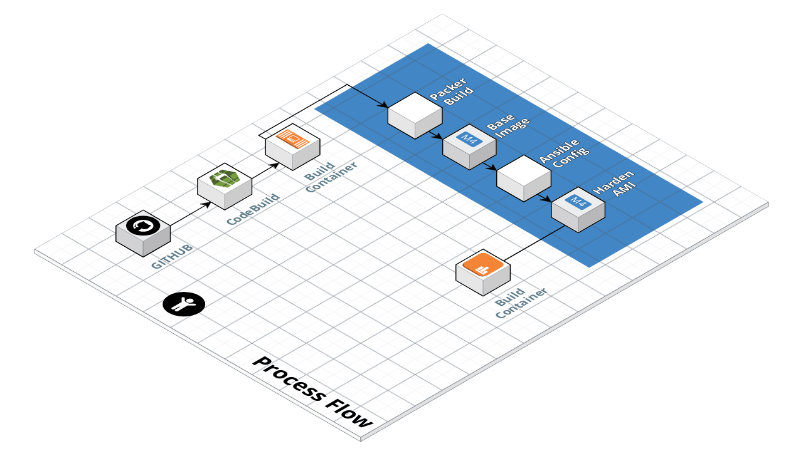

# AWS Amazon Linux 2 Harden

This Packer AMI Builder creates a new AMI out of the latest Amazon Linux AMI, and also provides a cloudformation template that leverages AWS CodePipeline to 
orchestrate the entire process. The following areas are covered within this repo

- CIS controls for Amazon Linux 2 LTE
- CloudWatch Logs Agent - Forwarder
- OSSEC for HIDS (host-based intrusion detection), log monitoring, and Security Incident Management (SIM)/Security Information and Event Management (SIEM)

#- Moving to Kube cluster 
 ClamAV for antivirus engine for detecting trojans, viruses, malware & other malicious threats




```bash
├── ansible
│   ├── playbook.yaml                       <-- Ansible playbook file
│   ├── requirements.yaml                   <-- RemovedAnsible Galaxy requirements containing additional Roles to be used (CIS, Cloudwatch Logs)
│   └── roles
│       ├── common                          <-- Upgrades all packages through ``yum``
├── buildspec.yml                           <-- CodeBuild spec 
├── cloudformation                          <-- Cloudformation to create entire pipeline
│   └── pipeline.yaml
├── packer_cis.json                         <-- Packer template for Pipeline
```
## What is logged and monitored
[Details on the security config](ansible/README.md)

## Cloudformation template
Cloudformation will create the following resources as part of the AMI Builder for Packer:

* ``cloudformation/pipeline.yaml``
    + AWS CodeCommit - Git repository /  Manual Switch to GITHUB
    + AWS CodeBuild - Downloads Packer and run Packer to build AMI 
    + AWS CodePipeline - Orchestrates pipeline and listen for new commits in CodeCommit
    + Amazon SNS Topic - AMI Builds Notification via subscribed email
    + Amazon Cloudwatch Events Rule - Custom Event for AMI Builder that will trigger SNS upon AMI completion
    + AWS IAM - With all of the needed Packer permissions

## Required
**Before you start**
TODO: Use check script
* Install [GIT](https://git-scm.com/downloads) if you don't have it
* Make sure AWS CLI is configured properly
* [Configured AWS CLI and Git](http://docs.aws.amazon.com/codecommit/latest/userguide/setting-up-https-unixes.html) to connect to AWS CodeCommit repositories

## Installation 
    1. Login to the AWS console with enough permisssions to create a cloudformation template
    2. Copy the template from [Cloudformation Template](cloudformation/pipeline.yaml)
    3. Paste in AWS Cloudformation and exec.
    4. TODO: Fix this.  Manual switch codecommit to GITHUB
    5. Git Commit on codebase and AWS pipeline will start

## Security Controls inherited from this operating system
    1.
    

TODO:
- Replace the entire cloudformation with terraform script.
- Add more Invokes conditions, currently only a commit but add version updates (lambda function)

https://s3-external-1.amazonaws.com/cf-templates-h7iqxoi3arkm-us-east-1/20180693MP-WorkingAMIPacker72xwrtvyjcj

### Reference 
- [Amazon Blog](https://aws.amazon.com/blogs/devops/how-to-create-an-ami-builder-with-aws-codebuild-and-hashicorp-packer/)
- [GITHUB Source for Amazon Blog](https://github.com/awslabs/ami-builder-packer) 
- [Amazon Cloudformation template](https://s3-external-1.amazonaws.com/cf-templates-h7iqxoi3arkm-us-east-1/20180693MP-WorkingAMIPacker72xwrtvyjcj) 
### Technologies
* [AWS CloudFormation](https://aws.amazon.com/cloudformation/) gives developers and systems administrators an easy way to create and manage a collection of related AWS resources, provisioning and updating them in an orderly and predictable fashion.
* [Amazon CloudWatch Events](https://docs.aws.amazon.com/AmazonCloudWatch/latest/events/WhatIsCloudWatchEvents.html) enables you to react selectively to events in the cloud and in your applications. Specifically, you can create CloudWatch Events rules that match event patterns, and take actions in response to those patterns.
* [AWS CodePipeline](https://aws.amazon.com/codepipeline/) is a continuous integration and continuous delivery service for fast and reliable application and infrastructure updates. AWS CodePipeline builds, tests, and deploys your code every time there is a code change, based on release process models you define.
* [Amazon SNS](https://aws.amazon.com/sns/) is a fast, flexible, fully managed push notification service that lets you send individual messages or to fan out messages to large numbers of recipients. Amazon SNS makes it simple and cost-effective to send push notifications to mobile device users or email recipients. The service can even send messages to other distributed services.
* [Ansible](https://www.ansible.com/) is a simple IT automation system that handles configuration management, application deployment, cloud provisioning, ad-hoc task-execution, and multinode orchestration.
* [Packer](https://www.packer.io/) easy to use and automates the creation of any type of machine image. It embraces modern configuration management by encouraging you to use automated scripts to install and configure the software

## Known issues
* If Build process fails and within AWS CodeBuild Build logs you find the following line ``Timeout waiting for SSH.``, it means either
    - A) You haven't chosen a VPC Public Subnet, and therefore Packer cannot connect to the instance
    - B) There may have been a connectivity issue between Packer and EC2; retrying the build step within AWS CodePipeline should work just fine 